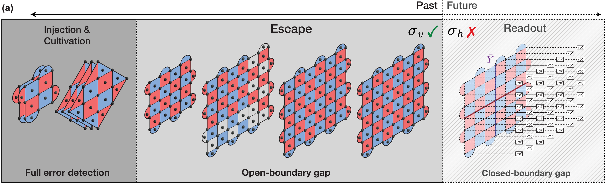
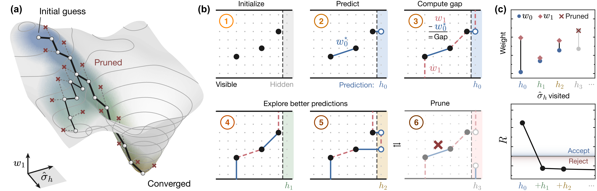

# Practical, mid-circuit post-selection in magic state cultivation.

<picture>
  <source media="(prefers-color-scheme: dark)" srcset="figures/1-dark.png">
  
</picture>

_Magic state cultivation with mid-circuit post-selection. More details available in [our paper](https://arxiv.org/abs/2610.06828)._

## Repository structure

This repository accompanies the paper [The Practical Cost of Magic State Cultivation](https://arxiv.org/abs/2610.06828). It is organized as follows:

    MSC-data/
    ├── data/
    ├── figures/
    └── circuits/
        └── escape sweep/

The circuits for [color-to-grafted code cultivation](https://arxiv.org/abs/2409.17595), along with the fault distance 3 circuit from [fold-transversal cultivation](https://arxiv.org/abs/2509.05212), are respectively obtained from the respective [Zenodo](https://zenodo.org/records/13777072) and [GitHub](https://github.com/kaavyas99/MSC_foldedH) project repositories. We reconstructed the fault distance 5 fold-transversal cultivation circuit similarly.

## Caliper

An efficient and accurate method to perform sliding-scale, mid-circuit post-selection for the surface code, the grafted code, and other matchable codes.

<picture>
  <source media="(prefers-color-scheme: dark)" srcset="figures/2-dark.png">
  
</picture>

_Coming soon._
